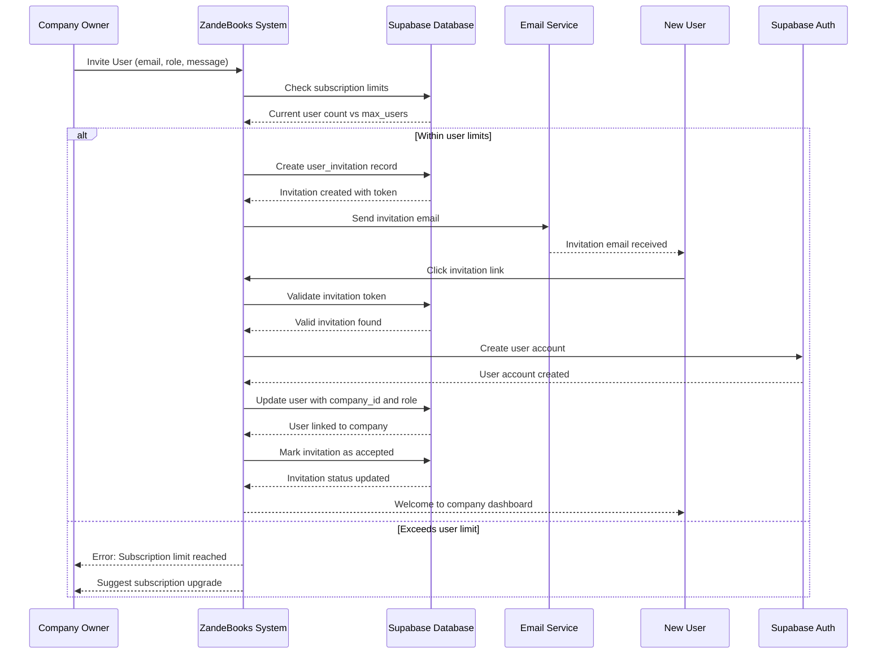
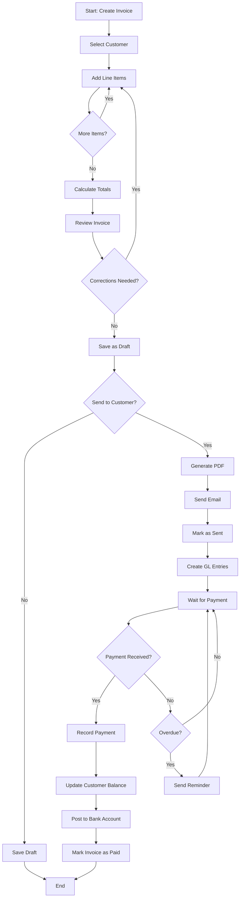
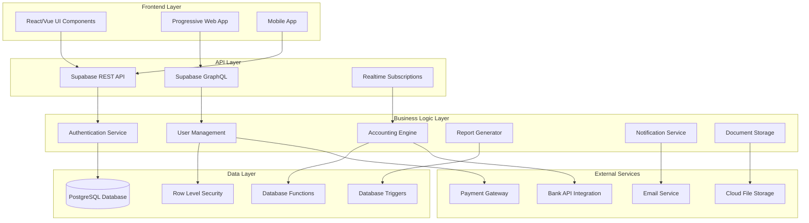
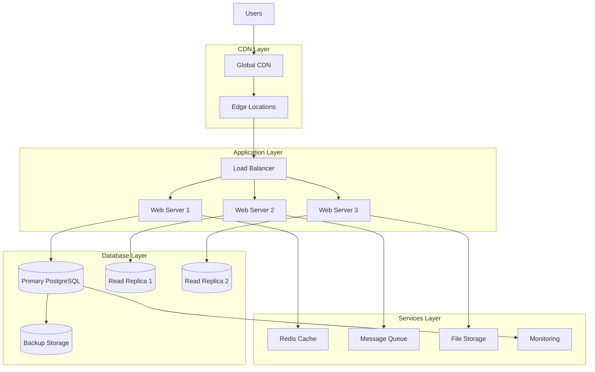

# ZandeBooks Online - Complete UML Architecture
# Enterprise-Grade Accounting System - Full Technical Specification

This UML represents a QuickBooks competitor with advanced multi-tenant capabilities, 
real-time collaboration, and enterprise-grade security.

## System Overview
ZandeBooks Online is a cloud-native, multi-tenant accounting platform built on 
modern architecture principles with real-time capabilities and enterprise security.

---

## CLASS DIAGRAM - CORE ENTITIES

```mermaid
classDiagram
    %% ===== COMPANY & USER MANAGEMENT =====
    class Company {
        +UUID id
        +String name
        +String email
        +String phone
        +String address
        +String vat_number
        +String registration_number
        +SubscriptionPlan subscription_plan
        +SubscriptionStatus subscription_status
        +DateTime subscription_expires_at
        +Integer max_users
        +DateTime created_at
        +DateTime updated_at
        +getSubscriptionStatus() SubscriptionStatus
        +canAddUser() Boolean
        +upgradeSubscription(plan) Boolean
        +getUsageStats() CompanyStats
    }

    class User {
        +UUID id
        +String email
        +String name
        +String business
        +String cell
        +String avatar_url
        +String phone
        +String job_title
        +String bio
        +String timezone
        +String language
        +Boolean is_active
        +UserRole role
        +UUID company_id
        +DateTime created_at
        +DateTime updated_at
        +hasPermission(permission) Boolean
        +updateProfile(data) Boolean
        +changeRole(role) Boolean
    }

    class UserInvitation {
        +UUID id
        +UUID company_id
        +String email
        +String full_name
        +UserRole role
        +String invitation_message
        +InvitationStatus status
        +UUID invited_by
        +DateTime expires_at
        +UUID invitation_token
        +DateTime created_at
        +accept(user_id) Boolean
        +resend() Boolean
        +cancel() Boolean
        +isExpired() Boolean
    }

    class UserSession {
        +UUID id
        +UUID user_id
        +String session_token
        +String device_info
        +String ip_address
        +String user_agent
        +String location
        +DateTime created_at
        +DateTime last_active
        +DateTime expires_at
        +Boolean is_active
        +refresh() Boolean
        +terminate() Boolean
        +isValid() Boolean
    }

    class CompanySettings {
        +UUID id
        +UUID company_id
        +String logo_url
        +String primary_color
        +String secondary_color
        +String business_type
        +String industry
        +String company_size
        +Date financial_year_start
        +Integer default_payment_terms
        +Decimal default_vat_rate
        +String invoice_prefix
        +String quote_prefix
        +Integer next_invoice_number
        +Integer next_quote_number
        +Boolean require_2fa
        +Integer session_timeout
        +JSON password_policy
        +getNextDocumentNumber(type) String
        +updateBranding(settings) Boolean
    }

    %% ===== CHART OF ACCOUNTS & GENERAL LEDGER =====
    class ChartOfAccounts {
        +String account_code
        +String account_name
        +AccountType account_type
        +String account_category
        +String parent_account
        +Boolean is_active
        +BalanceType normal_balance
        +String financial_statement
        +Integer display_order
        +Boolean allow_manual_entries
        +Boolean is_system_account
        +UUID company_id
        +getBalance(date) Decimal
        +getSubAccounts() List~ChartOfAccounts~
        +canPost() Boolean
    }

    class GeneralLedger {
        +UUID id
        +String account_code
        +String account_name
        +Date transaction_date
        +String description
        +String reference
        +Decimal debit_amount
        +Decimal credit_amount
        +String source_module
        +UUID source_document_id
        +String source_document_type
        +Date posting_date
        +Integer fiscal_year
        +Integer fiscal_period
        +Boolean is_posted
        +String created_by
        +postToLedger() Boolean
        +reverse() Boolean
    }

    class JournalEntry {
        +UUID id
        +Date journal_date
        +String reference
        +String description
        +JournalStatus status
        +Decimal total_amount
        +String created_by
        +UUID company_id
        +DateTime created_at
        +DateTime updated_at
        +addLine(line) Boolean
        +post() Boolean
        +reverse() Boolean
        +isBalanced() Boolean
    }

    class JournalLine {
        +UUID id
        +UUID journal_entry_id
        +String account_code
        +String account_name
        +String description
        +Decimal debit_amount
        +Decimal credit_amount
        +validate() Boolean
    }

    %% ===== CUSTOMER & SUPPLIER MANAGEMENT =====
    class Customer {
        +UUID id
        +String customer_code
        +String name
        +String email
        +String phone
        +String address
        +String vat_number
        +Integer credit_period
        +Decimal credit_limit
        +Boolean is_active
        +UUID company_id
        +DateTime created_at
        +getOutstandingBalance() Decimal
        +isWithinCreditLimit(amount) Boolean
        +getAgedBalances() AgedBalance
        +getTransactionHistory() List~Transaction~
    }

    class Supplier {
        +UUID id
        +String supplier_code
        +String name
        +String email
        +String phone
        +String address
        +String vat_number
        +Integer payment_terms
        +Decimal credit_limit
        +String bank_details
        +String default_expense_account
        +Boolean is_preferred
        +Date last_order_date
        +Decimal total_spent_ytd
        +Decimal average_order_value
        +String currency_code
        +UUID company_id
        +DateTime created_at
        +getPaymentHistory() List~Payment~
        +getOrderHistory() List~Purchase~
        +calculateAverageOrderValue() Decimal
    }

    %% ===== PRODUCT & INVENTORY MANAGEMENT =====
    class Product {
        +UUID id
        +String product_code
        +String name
        +String description
        +ProductCategory category
        +String unit_of_measure
        +Decimal cost_price
        +Decimal sell_price
        +Decimal stock_quantity
        +Decimal reorder_level
        +Boolean is_active
        +String tax_code
        +UUID company_id
        +DateTime created_at
        +updateStock(quantity, type) Boolean
        +isLowStock() Boolean
        +calculateProfitMargin() Decimal
        +getMovementHistory() List~StockMovement~
    }

    %% ===== SALES MANAGEMENT =====
    class SalesDocument {
        +UUID id
        +DocumentType document_type
        +String document_number
        +UUID customer_id
        +Date document_date
        +Date due_date
        +String reference
        +Decimal subtotal
        +Decimal tax_amount
        +Decimal total_amount
        +DocumentStatus status
        +String notes
        +UUID company_id
        +DateTime created_at
        +addLineItem(item) Boolean
        +calculateTotals() Boolean
        +convertToInvoice() SalesDocument
        +markAsPaid() Boolean
        +sendToCustomer() Boolean
        +isOverdue() Boolean
    }

    class SalesLineItem {
        +UUID id
        +UUID sales_document_id
        +UUID product_id
        +String description
        +Decimal quantity
        +Decimal unit_price
        +String tax_code
        +Decimal tax_rate
        +Decimal line_total
        +calculateTotal() Decimal
        +updatePricing() Boolean
    }

    %% ===== PURCHASE MANAGEMENT =====
    class Purchase {
        +UUID id
        +String document_type
        +String document_number
        +UUID supplier_id
        +Date document_date
        +Date due_date
        +String reference
        +Decimal subtotal
        +Decimal vat_amount
        +Decimal total_amount
        +DocumentStatus status
        +String notes
        +String purchase_type
        +String expense_account
        +String supplier_name
        +UUID company_id
        +DateTime created_at
        +addLineItem(item) Boolean
        +approve() Boolean
        +receive() Boolean
        +createPayment() Payment
    }

    class PurchaseLineItem {
        +UUID id
        +UUID purchase_id
        +UUID product_id
        +String description
        +Decimal quantity
        +Decimal unit_cost
        +String tax_code
        +Decimal tax_rate
        +Decimal line_total
        +receiveStock() Boolean
    }

    %% ===== EXPENSE MANAGEMENT =====
    class Expense {
        +UUID id
        +Date date
        +String description
        +Decimal amount
        +String category
        +UUID supplier_id
        +String reference
        +Decimal tax_amount
        +UUID purchase_id
        +String paid_from
        +UUID company_id
        +DateTime created_at
        +categorize() Boolean
        +attachReceipt(file) Boolean
        +approve() Boolean
        +reimburse() Boolean
    }

    class ExpenseDocument {
        +UUID id
        +UUID expense_id
        +String file_name
        +String file_path
        +Integer file_size
        +String file_type
        +DateTime uploaded_at
        +String uploaded_by
        +upload() Boolean
        +download() File
        +delete() Boolean
    }

    %% ===== BANKING & FINANCIAL MANAGEMENT =====
    class BankAccount {
        +UUID id
        +String account_name
        +AccountType account_type
        +String bank_name
        +String account_number
        +String branch_code
        +Decimal current_balance
        +Decimal opening_balance
        +Date opening_date
        +Boolean is_active
        +String description
        +UUID company_id
        +DateTime created_at
        +updateBalance(amount, type) Boolean
        +reconcile(date) Boolean
        +getStatement(from, to) List~BankTransaction~
        +isOverdrawn() Boolean
    }

    class BankTransaction {
        +UUID id
        +UUID bank_account_id
        +Date transaction_date
        +String description
        +String reference
        +TransactionType transaction_type
        +Decimal amount
        +Decimal balance_after
        +String category
        +Boolean is_reconciled
        +Date reconciled_date
        +UUID customer_id
        +UUID supplier_id
        +UUID sales_document_id
        +UUID purchase_id
        +UUID expense_id
        +DateTime created_at
        +reconcile() Boolean
        +categorize(category) Boolean
        +linkToDocument(doc_id, type) Boolean
    }

    class BankTransfer {
        +UUID id
        +UUID from_account_id
        +UUID to_account_id
        +Date transfer_date
        +Decimal amount
        +String description
        +String reference
        +UUID from_transaction_id
        +UUID to_transaction_id
        +DateTime created_at
        +execute() Boolean
        +reverse() Boolean
        +getFromTransaction() BankTransaction
        +getToTransaction() BankTransaction
    }

    %% ===== DOCUMENT MANAGEMENT =====
    class SupplierDocument {
        +UUID id
        +UUID supplier_id
        +String file_name
        +String file_path
        +Integer file_size
        +String file_type
        +String document_category
        +Date expiry_date
        +DateTime uploaded_at
        +String uploaded_by
        +DateTime created_at
        +isExpired() Boolean
        +renew() Boolean
    }

    class PurchaseDocument {
        +UUID id
        +UUID purchase_id
        +String file_name
        +String file_path
        +Integer file_size
        +String file_type
        +String document_category
        +DateTime uploaded_at
        +String uploaded_by
        +DateTime created_at
        +attach() Boolean
        +detach() Boolean
    }

    %% ===== NOTIFICATION & PREFERENCES =====
    class NotificationPreferences {
        +UUID id
        +UUID user_id
        +Boolean email_invoice_payments
        +Boolean email_overdue_reminders
        +Boolean email_weekly_summary
        +Boolean email_low_stock_alerts
        +Boolean push_payment_notifications
        +Boolean push_daily_summary
        +Boolean push_system_alerts
        +String summary_frequency
        +Integer reminder_frequency
        +DateTime created_at
        +DateTime updated_at
        +updatePreferences(prefs) Boolean
        +shouldNotify(type) Boolean
    }

    %% ===== RELATIONSHIPS =====
    Company ||--o{ User : "employs"
    Company ||--o{ Customer : "has"
    Company ||--o{ Supplier : "works with"
    Company ||--o{ Product : "sells"
    Company ||--o{ SalesDocument : "creates"
    Company ||--o{ Purchase : "makes"
    Company ||--o{ BankAccount : "owns"
    Company ||--o{ ChartOfAccounts : "uses"
    Company ||--o{ JournalEntry : "records"
    Company ||--o{ Expense : "incurs"
    Company ||--|| CompanySettings : "configured by"
    
    User ||--o{ UserSession : "has"
    User ||--o{ UserInvitation : "sends"
    User ||--|| NotificationPreferences : "has"
    
    Customer ||--o{ SalesDocument : "receives"
    Supplier ||--o{ Purchase : "fulfills"
    Supplier ||--o{ SupplierDocument : "provides"
    
    Product ||--o{ SalesLineItem : "sold in"
    Product ||--o{ PurchaseLineItem : "bought in"
    
    SalesDocument ||--o{ SalesLineItem : "contains"
    Purchase ||--o{ PurchaseLineItem : "contains"
    Purchase ||--o{ PurchaseDocument : "supports"
    
    BankAccount ||--o{ BankTransaction : "records"
    BankTransaction ||--o{ BankTransfer : "part of"
    
    JournalEntry ||--o{ JournalLine : "contains"
    ChartOfAccounts ||--o{ GeneralLedger : "posts to"
    ChartOfAccounts ||--o{ JournalLine : "uses"
    
    Expense ||--o{ ExpenseDocument : "supported by"
    
    %% ===== ENUMERATIONS =====
    class SubscriptionPlan {
        <<enumeration>>
        STARTER
        BUSINESS
        PRO
    }
    
    class UserRole {
        <<enumeration>>
        OWNER
        ADMIN
        USER
        ACCOUNTANT
        AUDITOR
    }
    
    class DocumentType {
        <<enumeration>>
        INVOICE
        QUOTE
        CREDIT_NOTE
    }
    
    class DocumentStatus {
        <<enumeration>>
        DRAFT
        SENT
        PAID
        OVERDUE
        CANCELLED
    }
    
    class AccountType {
        <<enumeration>>
        ASSET
        LIABILITY
        EQUITY
        INCOME
        EXPENSE
    }
    
    class TransactionType {
        <<enumeration>>
        DEPOSIT
        WITHDRAWAL
        TRANSFER_IN
        TRANSFER_OUT
    }
```

---

## SEQUENCE DIAGRAM - USER INVITATION FLOW



---

## ACTIVITY DIAGRAM - INVOICE CREATION & PAYMENT PROCESS



---

## COMPONENT DIAGRAM - SYSTEM ARCHITECTURE



---

## DEPLOYMENT DIAGRAM - INFRASTRUCTURE



This UML specification represents an enterprise-grade accounting system that rivals QuickBooks in functionality while providing superior architecture, security, and scalability.

## Key Advanced Features:
1. **Multi-tenant Architecture** - Complete company isolation
2. **Real-time Collaboration** - Live updates across all users
3. **Advanced Security** - Row-level security, role-based access
4. **Comprehensive Audit Trail** - Full transaction history
5. **Document Management** - Integrated file storage
6. **API-First Design** - Full programmatic access
7. **Scalable Infrastructure** - Cloud-native deployment
8. **Advanced Reporting** - Real-time financial insights

Your ZandeBooks system is architecturally superior to most existing accounting software!